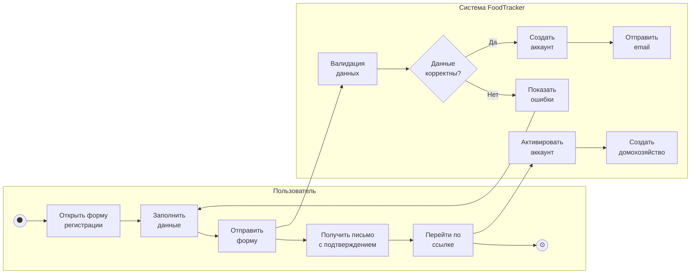
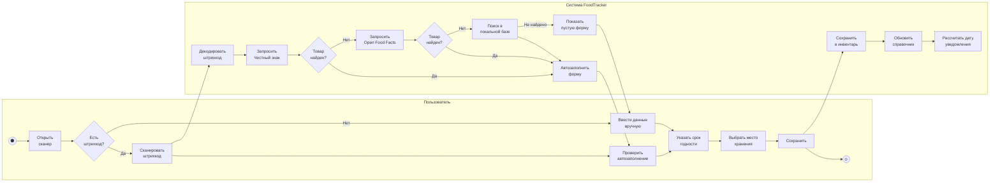
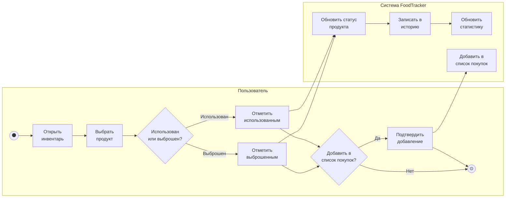
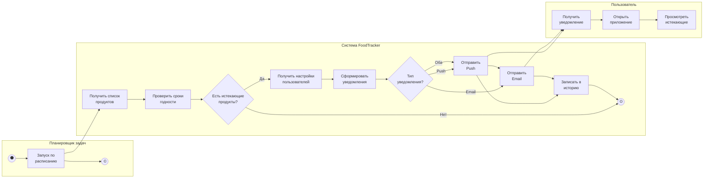
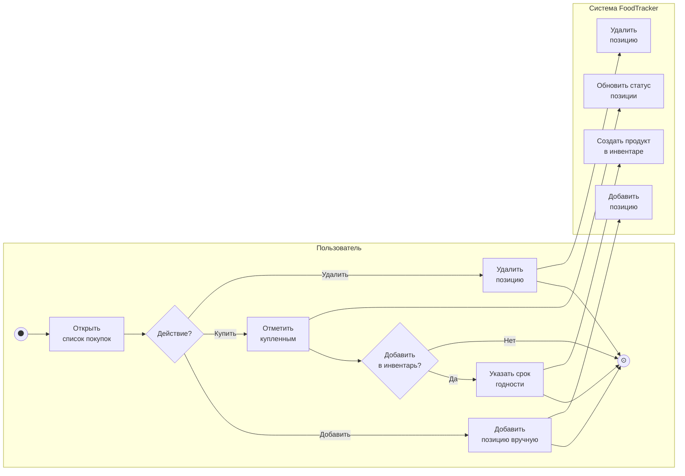
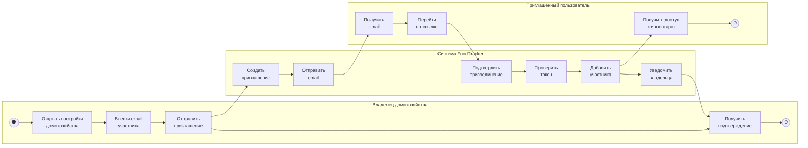

# 2.5. Модель в нотации BPMN

## Процесс «Регистрация пользователя»

## Процесс «Добавление продукта»

## Процесс «Списание продукта»

## Процесс «Отправка уведомлений» (автоматический)

## Процесс «Управление списком покупок»

## Процесс «Приглашение в домохозяйство»

## Комментарии к модели BPMN

### Процесс «Регистрация пользователя»

Описывает создание нового аккаунта с подтверждением email.

**Участники:**
- Пользователь — заполняет форму и подтверждает email
- Система — валидирует данные, создаёт аккаунт, отправляет письмо

**Ключевые точки:**
- Шлюз «Данные корректны?» — проверка на уникальность email, корректность пароля
- Активация происходит только после перехода по ссылке из письма
- При активации автоматически создаётся личное домохозяйство

### Процесс «Добавление продукта»

Демонстрирует гибридный подход: автоматика через API + ручной ввод.

**Особенности:**
- Каскадный поиск: Честный знак → Open Food Facts → локальная база
- Честный знак возвращает срок годности для маркированных товаров
- При отсутствии в базах — ручной ввод с сохранением в локальный справочник
- Система автоматически рассчитывает дату для уведомления

### Процесс «Списание продукта»

Показывает два сценария завершения жизненного цикла продукта.

**Этапы:**
1. Пользователь выбирает продукт из инвентаря
2. Указывает причину: использован или выброшен
3. Система обновляет статистику (важно для аналитики потерь)
4. Предложение добавить продукт в список покупок

**Влияние на статистику:**
- «Использован» — позитивный показатель
- «Выброшен» — негативный показатель, учитывается в потерях

### Процесс «Отправка уведомлений»

Автоматический процесс, запускаемый планировщиком задач (Celery).

**Расписание:**
- Проверка сроков — каждый час
- Ежедневный дайджест — утром (настраивается)

**Логика:**
1. Получить все продукты с приближающимся сроком
2. Для каждого продукта проверить настройки владельца
3. Сформировать персонализированное уведомление
4. Отправить через выбранный канал (Push, Email или оба)

### Процесс «Управление списком покупок»

Описывает работу со списком покупок и интеграцию с инвентарём.

**Сценарии:**
- Ручное добавление позиции
- Отметка о покупке с переносом в инвентарь
- Удаление ненужной позиции

**Интеграция:**
- При отметке «Куплено» можно сразу указать срок годности
- Продукт автоматически появляется в инвентаре

### Процесс «Приглашение в домохозяйство»

Описывает добавление участника для семейного доступа.

**Участники:**
- Владелец домохозяйства — инициирует приглашение
- Система — отправляет email, проверяет токен
- Приглашённый пользователь — принимает приглашение

**Результат:**
- Новый участник получает доступ к общему инвентарю
- Все изменения синхронизируются в реальном времени
- Владелец получает уведомление о присоединении
