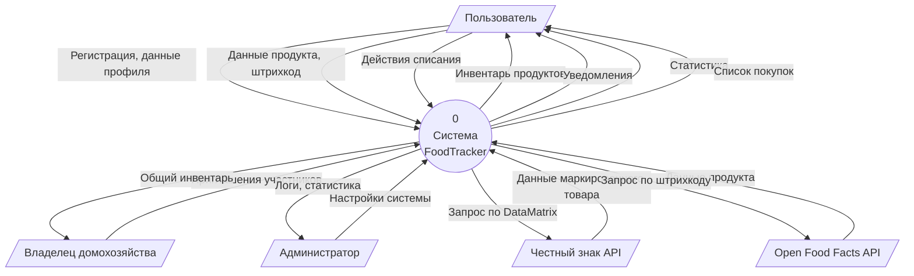
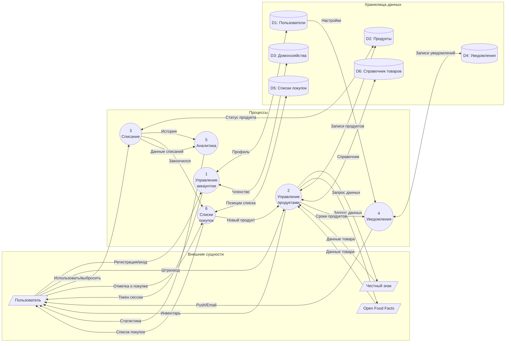
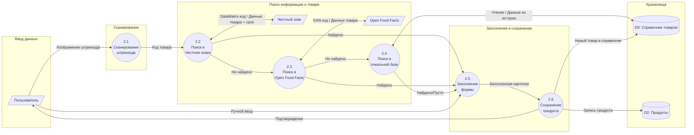
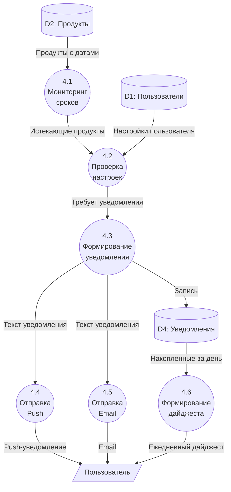

# 2.4. Фрагменты модели в нотации DFD

## Контекстная диаграмма (уровень 0)

## Диаграмма уровня 1 — Декомпозиция системы

## Фрагмент: Процесс «Добавление продукта» (уровень 2)

## Фрагмент: Процесс «Формирование уведомлений» (уровень 2)

## Комментарии к модели DFD

### Контекстная диаграмма (уровень 0)

Показывает границы системы и её взаимодействие с внешними сущностями:

**Внешние сущности:**
- *Пользователь* — основной актор, выполняет большинство операций: регистрация, добавление продуктов, списание, просмотр статистики
- *Владелец домохозяйства* — управляет семейным доступом, приглашает участников
- *Администратор* — управляет настройками системы, получает логи
- *Честный знак API* — источник данных о маркированных товарах (молочка, вода, пиво)
- *Open Food Facts API* — открытая база данных продуктов питания

**Ключевые потоки данных:**
- Входящие от пользователя: регистрационные данные, информация о продуктах, штрихкоды, действия списания
- Исходящие к пользователю: инвентарь, уведомления, статистика, списки покупок

### Диаграмма уровня 1

Система декомпозирована на шесть основных процессов:

**Процесс 1: Управление аккаунтом**
Регистрация, аутентификация, редактирование профиля, управление домохозяйством. Взаимодействует с хранилищами D1 (Пользователи) и D3 (Домохозяйства). Выдаёт токен сессии для авторизации.

**Процесс 2: Управление продуктами**
Добавление, редактирование, удаление продуктов. Запрашивает данные у внешних API по штрихкоду. Работает с хранилищами D2 (Продукты) и D6 (Справочник товаров).

**Процесс 3: Списание**
Фиксация использования или утилизации продукта. Обновляет статус в D2, передаёт данные в аналитику (P5) и предлагает добавить в список покупок (P6).

**Процесс 4: Уведомления**
Мониторинг сроков годности, формирование и отправка уведомлений. Читает настройки из D1, сроки из D2, сохраняет историю в D4.

**Процесс 5: Аналитика**
Обработка данных о потреблении. Получает историю списаний, рассчитывает статистику: использовано/выброшено, экономия, тренды.

**Процесс 6: Списки покупок**
Формирование и управление списком покупок. Получает данные о закончившихся продуктах, сохраняет позиции в D5. При отметке о покупке инициирует добавление в инвентарь.

**Хранилища данных:**
- D1: Пользователи — профили, учётные данные, настройки уведомлений
- D2: Продукты — инвентарь продуктов всех пользователей
- D3: Домохозяйства — семейные группы и их участники
- D4: Уведомления — история отправленных уведомлений
- D5: Списки покупок — позиции списков
- D6: Справочник товаров — локальная база данных о товарах по штрихкодам

### Фрагмент уровня 2: Добавление продукта

Детализация процесса 2 на шесть подпроцессов:

**2.1 Сканирование штрихкода** — получение изображения с камеры, декодирование штрихкода (EAN-13, EAN-8, DataMatrix).

**2.2 Поиск в Честном знаке** — приоритетный запрос для маркированных товаров. Возвращает название, производителя и срок годности конкретной партии.

**2.3 Поиск в Open Food Facts** — fallback при отсутствии в Честном знаке. Возвращает название, категорию, изображение. Срок годности отсутствует.

**2.4 Поиск в локальной базе** — проверка справочника ранее добавленных товаров. Ускоряет повторный ввод.

**2.5 Заполнение формы** — автозаполнение найденными данными или ручной ввод. Пользователь указывает срок годности, количество, место хранения.

**2.6 Сохранение продукта** — запись в инвентарь, добавление нового товара в локальный справочник для будущих сканирований.

### Фрагмент уровня 2: Формирование уведомлений

Детализация процесса 4 на шесть подпроцессов:

**4.1 Мониторинг сроков** — периодическая проверка всех продуктов на приближение срока годности (по расписанию, например каждый час).

**4.2 Проверка настроек** — сопоставление с настройками пользователя: за сколько дней уведомлять, включены ли уведомления.

**4.3 Формирование уведомления** — создание текста уведомления с названием продукта и оставшимся сроком.

**4.4 Отправка Push** — отправка push-уведомления через Firebase Cloud Messaging.

**4.5 Отправка Email** — отправка email-уведомления (если включено в настройках).

**4.6 Формирование дайджеста** — сбор всех уведомлений за день и отправка единого ежедневного отчёта.
