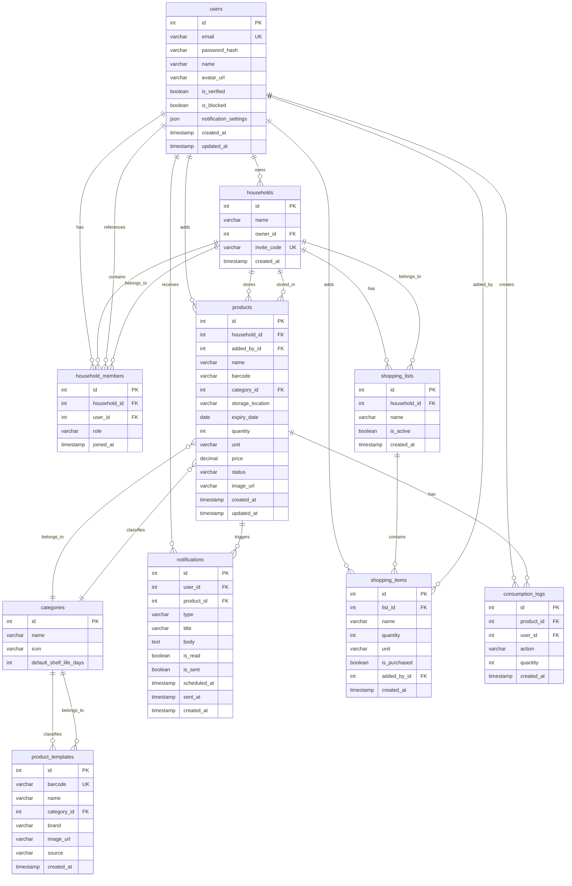

# 2.7. ER-диаграмма

## Диаграмма сущность-связь



## Описание сущностей

### users (Пользователи)

| Поле | Тип | Описание |
|------|-----|----------|
| id | INT, PK | Уникальный идентификатор |
| email | VARCHAR(255), UK | Email (уникальный) |
| password_hash | VARCHAR(255) | Хэш пароля (bcrypt) |
| name | VARCHAR(100) | Отображаемое имя |
| avatar_url | VARCHAR(500) | URL аватара |
| is_verified | BOOLEAN | Подтверждён ли email |
| is_blocked | BOOLEAN | Заблокирован ли аккаунт |
| notification_settings | JSON | Настройки уведомлений |
| created_at | TIMESTAMP | Дата регистрации |
| updated_at | TIMESTAMP | Дата последнего обновления |

**Структура notification_settings:**
```json
{
  "push_enabled": true,
  "email_enabled": false,
  "notify_days_before": [1, 3, 7],
  "daily_digest_time": "09:00",
  "digest_enabled": true
}
```

### households (Домохозяйства)

| Поле | Тип | Описание |
|------|-----|----------|
| id | INT, PK | Уникальный идентификатор |
| name | VARCHAR(100) | Название домохозяйства |
| owner_id | INT, FK | Владелец → users.id |
| invite_code | VARCHAR(20), UK | Код для приглашения участников |
| created_at | TIMESTAMP | Дата создания |

### household_members (Участники домохозяйства)

| Поле | Тип | Описание |
|------|-----|----------|
| id | INT, PK | Уникальный идентификатор |
| household_id | INT, FK | Домохозяйство → households.id |
| user_id | INT, FK | Пользователь → users.id |
| role | VARCHAR(20) | Роль: owner / member |
| joined_at | TIMESTAMP | Дата присоединения |

### categories (Категории продуктов)

| Поле | Тип | Описание |
|------|-----|----------|
| id | INT, PK | Уникальный идентификатор |
| name | VARCHAR(50) | Название категории |
| icon | VARCHAR(50) | Иконка (emoji или код) |
| default_shelf_life_days | INT | Срок хранения по умолчанию (дней) |

### products (Продукты)

| Поле | Тип | Описание |
|------|-----|----------|
| id | INT, PK | Уникальный идентификатор |
| household_id | INT, FK | Домохозяйство → households.id |
| added_by_id | INT, FK | Кто добавил → users.id |
| name | VARCHAR(255) | Название продукта |
| barcode | VARCHAR(50) | Штрихкод (EAN, DataMatrix) |
| category_id | INT, FK | Категория → categories.id |
| storage_location | VARCHAR(50) | Место хранения |
| expiry_date | DATE | Срок годности |
| quantity | INT | Количество |
| unit | VARCHAR(20) | Единица измерения |
| price | DECIMAL(10,2) | Цена за единицу |
| status | VARCHAR(20) | Статус: active / expiring_soon / expired / consumed / discarded |
| image_url | VARCHAR(500) | URL изображения |
| created_at | TIMESTAMP | Дата добавления |
| updated_at | TIMESTAMP | Дата последнего обновления |

### product_templates (Справочник товаров)

| Поле | Тип | Описание |
|------|-----|----------|
| id | INT, PK | Уникальный идентификатор |
| barcode | VARCHAR(50), UK | Штрихкод (уникальный) |
| name | VARCHAR(255) | Название товара |
| category_id | INT, FK | Категория → categories.id |
| brand | VARCHAR(100) | Бренд/производитель |
| image_url | VARCHAR(500) | URL изображения |
| source | VARCHAR(50) | Источник: chestnyznak / openfoodfacts / manual |
| created_at | TIMESTAMP | Дата добавления |

### notifications (Уведомления)

| Поле | Тип | Описание |
|------|-----|----------|
| id | INT, PK | Уникальный идентификатор |
| user_id | INT, FK | Получатель → users.id |
| product_id | INT, FK | Продукт → products.id |
| type | VARCHAR(50) | Тип: expiring_soon / expired / daily_digest |
| title | VARCHAR(255) | Заголовок |
| body | TEXT | Текст уведомления |
| is_read | BOOLEAN | Прочитано ли |
| is_sent | BOOLEAN | Отправлено ли |
| scheduled_at | TIMESTAMP | Запланированное время отправки |
| sent_at | TIMESTAMP | Фактическое время отправки |
| created_at | TIMESTAMP | Дата создания |

### shopping_lists (Списки покупок)

| Поле | Тип | Описание |
|------|-----|----------|
| id | INT, PK | Уникальный идентификатор |
| household_id | INT, FK | Домохозяйство → households.id |
| name | VARCHAR(100) | Название списка |
| is_active | BOOLEAN | Активный ли список |
| created_at | TIMESTAMP | Дата создания |

### shopping_items (Позиции списка покупок)

| Поле | Тип | Описание |
|------|-----|----------|
| id | INT, PK | Уникальный идентификатор |
| list_id | INT, FK | Список → shopping_lists.id |
| name | VARCHAR(255) | Название товара |
| quantity | INT | Количество |
| unit | VARCHAR(20) | Единица измерения |
| is_purchased | BOOLEAN | Куплено ли |
| added_by_id | INT, FK | Кто добавил → users.id |
| created_at | TIMESTAMP | Дата добавления |

### consumption_logs (Логи потребления)

| Поле | Тип | Описание |
|------|-----|----------|
| id | INT, PK | Уникальный идентификатор |
| product_id | INT, FK | Продукт → products.id |
| user_id | INT, FK | Пользователь → users.id |
| action | VARCHAR(20) | Действие: consumed / discarded / partial_use |
| quantity | INT | Количество (для частичного использования) |
| created_at | TIMESTAMP | Дата действия |

## Связи между сущностями

| Связь | Тип | Описание |
|-------|-----|----------|
| users → households | 1:N | Пользователь владеет несколькими домохозяйствами |
| users → household_members | 1:N | Пользователь участвует в нескольких домохозяйствах |
| households → household_members | 1:N | Домохозяйство содержит нескольких участников |
| households → products | 1:N | Домохозяйство хранит много продуктов |
| households → shopping_lists | 1:N | Домохозяйство имеет несколько списков покупок |
| categories → products | 1:N | Категория объединяет много продуктов |
| products → notifications | 1:N | Продукт генерирует несколько уведомлений |
| products → consumption_logs | 1:N | Продукт имеет историю потребления |
| shopping_lists → shopping_items | 1:N | Список содержит много позиций |

## Индексы

```sql
-- Поиск продуктов
CREATE INDEX idx_products_household ON products(household_id);
CREATE INDEX idx_products_expiry ON products(expiry_date);
CREATE INDEX idx_products_status ON products(status);
CREATE INDEX idx_products_barcode ON products(barcode);
CREATE INDEX idx_products_name ON products USING gin(to_tsvector('russian', name));

-- Уведомления
CREATE INDEX idx_notifications_user ON notifications(user_id, is_read);
CREATE INDEX idx_notifications_scheduled ON notifications(scheduled_at) WHERE NOT is_sent;

-- Справочник товаров
CREATE INDEX idx_product_templates_barcode ON product_templates(barcode);

-- Участники домохозяйства
CREATE INDEX idx_household_members_user ON household_members(user_id);
CREATE INDEX idx_household_members_household ON household_members(household_id);

-- Логи потребления (для статистики)
CREATE INDEX idx_consumption_logs_product ON consumption_logs(product_id);
CREATE INDEX idx_consumption_logs_date ON consumption_logs(created_at);
CREATE INDEX idx_consumption_logs_action ON consumption_logs(action);

-- Списки покупок
CREATE INDEX idx_shopping_items_list ON shopping_items(list_id);
CREATE INDEX idx_shopping_items_purchased ON shopping_items(is_purchased);
```

## Значения по умолчанию для категорий

```sql
INSERT INTO categories (name, icon, default_shelf_life_days) VALUES
('Молочные продукты', '🥛', 7),
('Мясо и птица', '🍖', 3),
('Рыба и морепродукты', '🐟', 2),
('Овощи', '🥕', 14),
('Фрукты', '🍎', 7),
('Хлеб и выпечка', '🍞', 3),
('Напитки', '🥤', 180),
('Консервы', '🥫', 730),
('Замороженные продукты', '🧊', 90),
('Крупы и макароны', '🌾', 365),
('Соусы и приправы', '🧂', 180),
('Сладости', '🍫', 90),
('Готовые блюда', '🍱', 2),
('Другое', '📦', 30);
```
