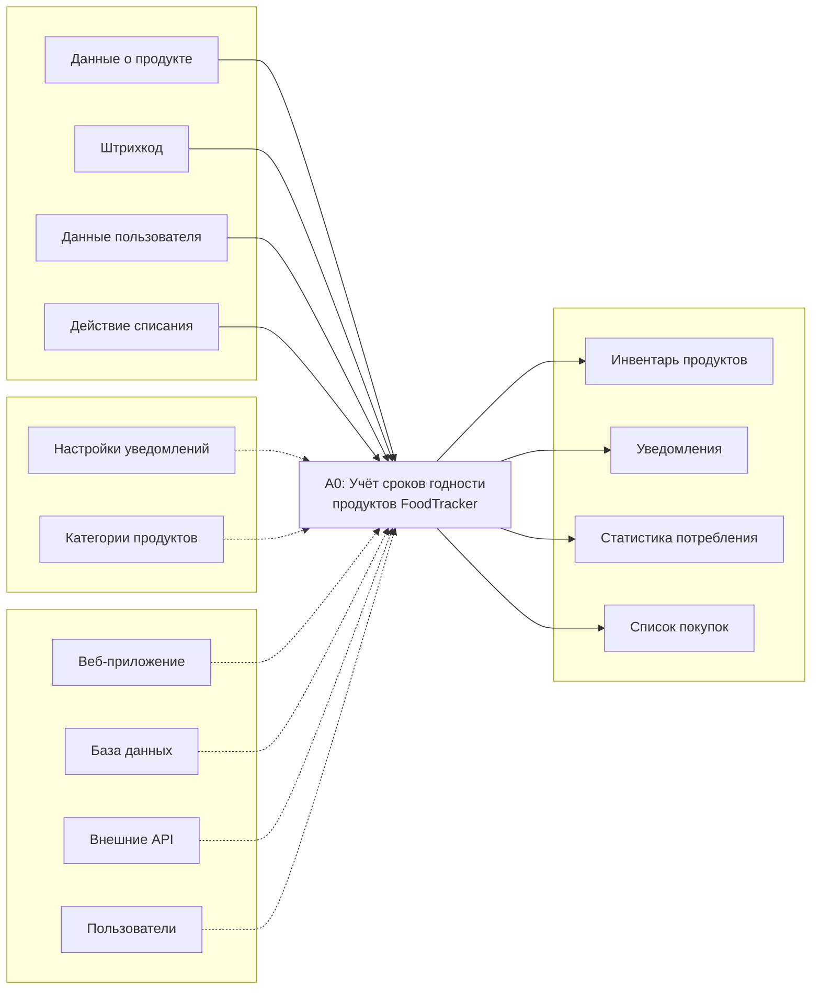
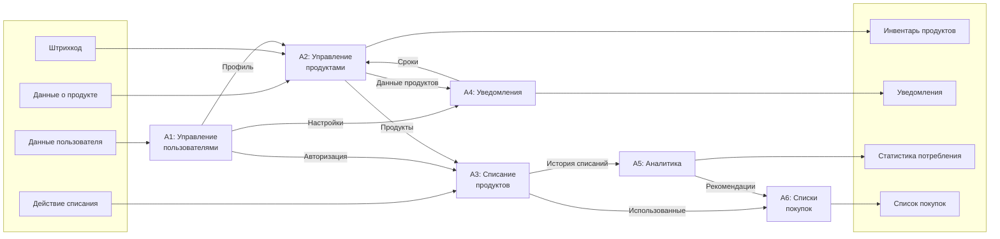
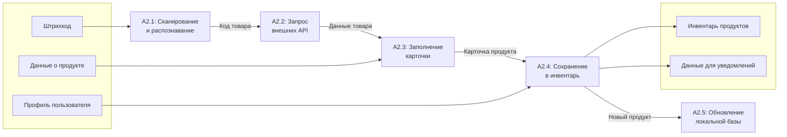

# 2.3. Модель в нотации IDEF0

## Контекстная диаграмма A-0

## Декомпозиция первого уровня A0

## Декомпозиция процесса A2: Управление продуктами

## Комментарии к модели IDEF0

### Контекстная диаграмма A-0

Диаграмма верхнего уровня представляет систему FoodTracker как единый функциональный блок «Учёт сроков годности продуктов».

**Входы (слева):**
- *Данные о продукте* — информация, вводимая пользователем при добавлении продукта (название, категория, срок годности, количество, место хранения)
- *Штрихкод* — код товара для автоматического получения данных
- *Данные пользователя* — регистрационные данные, настройки профиля
- *Действие списания* — отметка об использовании или утилизации продукта

**Выходы (справа):**
- *Инвентарь продуктов* — актуальный список продуктов с информацией о сроках
- *Уведомления* — напоминания об истекающих и просроченных продуктах
- *Статистика потребления* — аналитика использования и потерь
- *Список покупок* — перечень продуктов для приобретения

**Управление (сверху):**
- *Настройки уведомлений* — параметры: за сколько дней предупреждать, время отправки
- *Категории продуктов* — справочник категорий для классификации

**Механизмы (снизу):**
- *Веб-приложение* — программный интерфейс системы (PWA)
- *База данных* — хранилище информации (PostgreSQL)
- *Внешние API* — Честный знак, Open Food Facts для получения данных о товарах
- *Пользователи* — участники системы, выполняющие действия

### Декомпозиция A0

Система разбита на шесть функциональных блоков:

**A1: Управление пользователями**
Регистрация, авторизация, редактирование профиля, управление домохозяйством. Выход — профиль пользователя и настройки, которые используются остальными подсистемами.

**A2: Управление продуктами**
Добавление, редактирование, удаление продуктов. Сканирование штрихкодов и интеграция с внешними API. Формирует инвентарь и предоставляет данные для уведомлений.

**A3: Списание продуктов**
Фиксация использования или утилизации продукта. Передаёт данные в аналитику и предлагает добавить продукт в список покупок.

**A4: Уведомления**
Мониторинг сроков годности, формирование и отправка уведомлений согласно настройкам пользователя. Push, email, ежедневный дайджест.

**A5: Аналитика**
Сбор и обработка данных о потреблении. Расчёт статистики: использовано/выброшено, экономия, тренды, проблемные категории.

**A6: Списки покупок**
Формирование списка на основе закончившихся продуктов и рекомендаций аналитики. Управление позициями, перенос купленного в инвентарь.

### Декомпозиция A2: Управление продуктами

Детализация процесса добавления продукта на пять подпроцессов:

**A2.1: Сканирование и распознавание**
Получение изображения штрихкода с камеры устройства, декодирование в числовой код (EAN-13, EAN-8, DataMatrix для Честного знака).

**A2.2: Запрос внешних API**
Последовательный запрос: Честный знак (для маркированных товаров) → Open Food Facts → локальная база. Возврат найденных данных или пустого результата.

**A2.3: Заполнение карточки**
Автозаполнение полей из API или ручной ввод пользователем. Обязательные поля: название, срок годности. Опциональные: категория, количество, место хранения, цена.

**A2.4: Сохранение в инвентарь**
Запись продукта в базу данных с привязкой к пользователю/домохозяйству. Расчёт даты для уведомления.

**A2.5: Обновление локальной базы**
Сохранение данных о новом продукте (название, категория по штрихкоду) для ускорения последующих сканирований.
