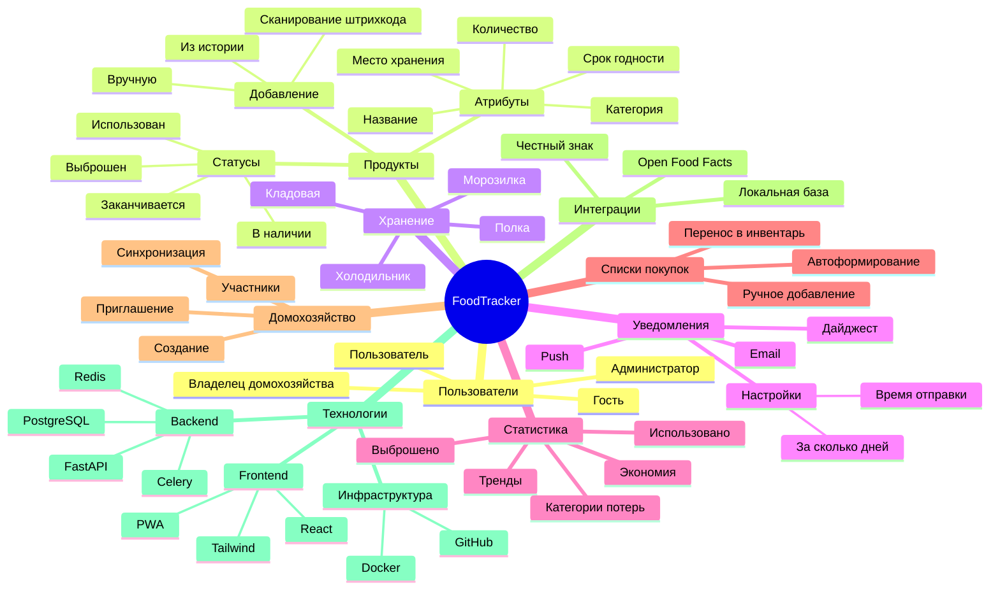

# 2.2. Ментальная карта

## Диаграмма

## Комментарии к ментальной карте

### Пользователи
Система предусматривает четыре роли с разным уровнем доступа. Гость может только просматривать описание сервиса и регистрироваться. Пользователь получает полный доступ к учёту продуктов. Владелец домохозяйства управляет семейным доступом. Администратор контролирует всю систему и модерирует базу продуктов.

### Продукты
Центральная сущность системы. Продукт можно добавить тремя способами: вручную через форму, сканированием штрихкода с автозаполнением, или выбором из истории ранее добавленных продуктов. Каждый продукт имеет название, категорию, срок годности, количество и место хранения. Жизненный цикл продукта: в наличии → заканчивается → использован/выброшен.

### Хранение
Продукты распределяются по местам хранения для удобной навигации. Стандартные места: холодильник, морозилка, кладовая, полка. Пользователь может создавать собственные места хранения.

### Уведомления
Ключевая функция системы. Push-уведомления и email-рассылка предупреждают об истекающих сроках. Ежедневный дайджест собирает информацию о продуктах, требующих внимания. Пользователь настраивает: за сколько дней предупреждать (1, 3, 7 дней) и время отправки.

### Статистика
Аналитический модуль для оптимизации потребления. Показывает соотношение использованных и выброшенных продуктов, расчёт экономии в рублях, тренды по месяцам и категории с наибольшими потерями. Помогает выявить продукты, которые регулярно пропадают.

### Списки покупок
Интеграция с учётом продуктов. Закончившиеся или использованные продукты автоматически предлагаются к добавлению в список покупок. После покупки товар переносится обратно в инвентарь с указанием нового срока годности.

### Домохозяйство
Функция для семей и совместного проживания. Владелец создаёт домохозяйство и приглашает участников. Все члены видят общий список продуктов, могут добавлять и списывать. Изменения синхронизируются в реальном времени.

### Интеграции
Гибридный подход к получению данных о продуктах. Честный знак — приоритетный источник для маркированных товаров в РФ (содержит срок годности). Open Food Facts — fallback для международных продуктов. Локальная база накапливает данные о ранее добавленных продуктах для ускорения повторного ввода.

### Технологии
Стек разделён на три уровня. Backend: FastAPI (Python) + PostgreSQL + Redis для кэширования + Celery для отложенных задач (уведомления). Frontend: React + Tailwind CSS + PWA для офлайн-работы и push-уведомлений. Инфраструктура: Docker для контейнеризации, GitHub для хостинга кода и CI/CD.
