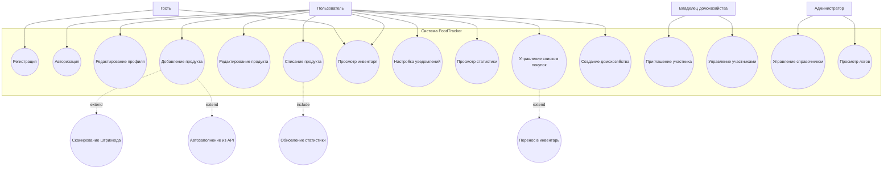
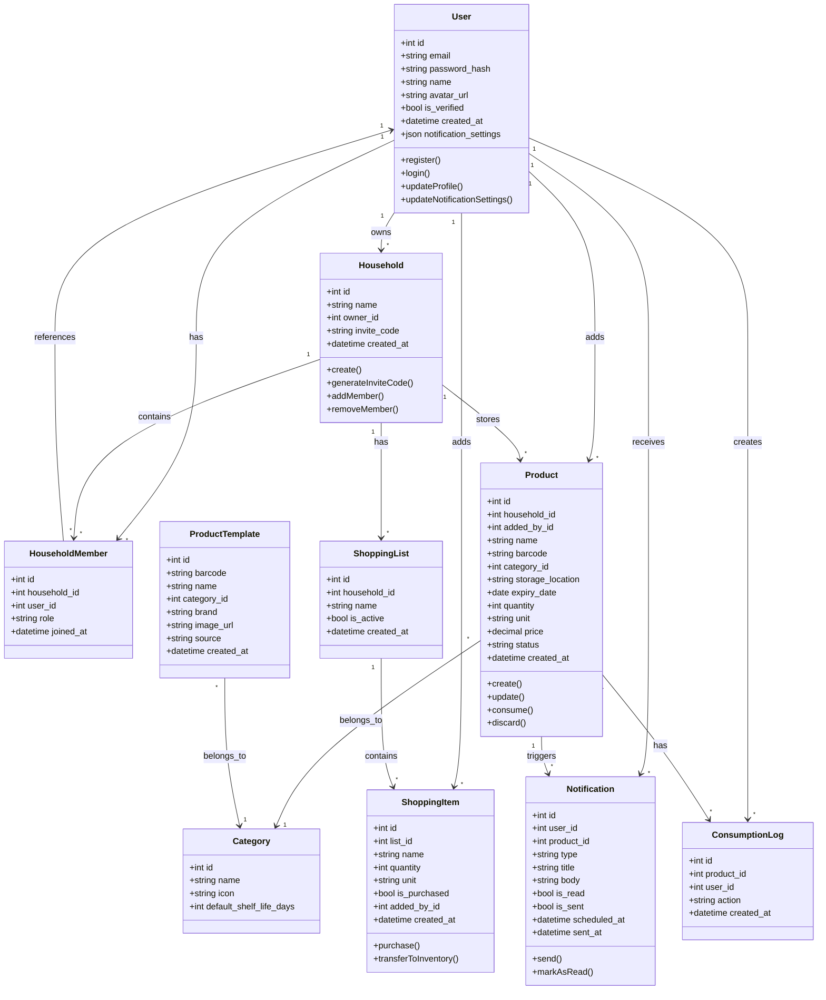
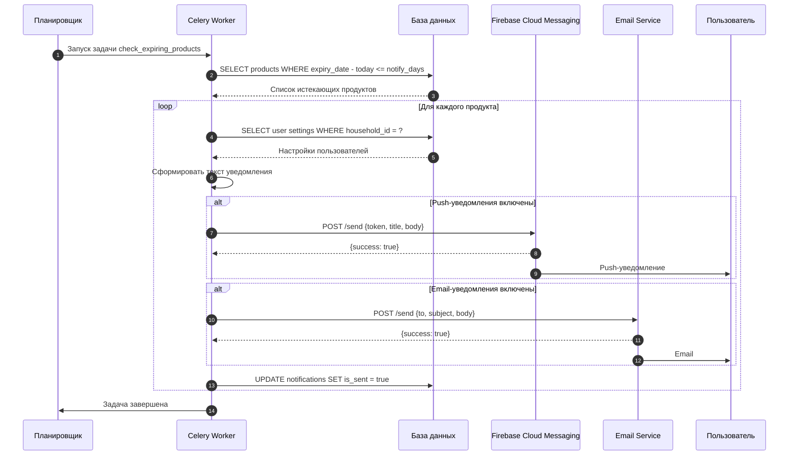
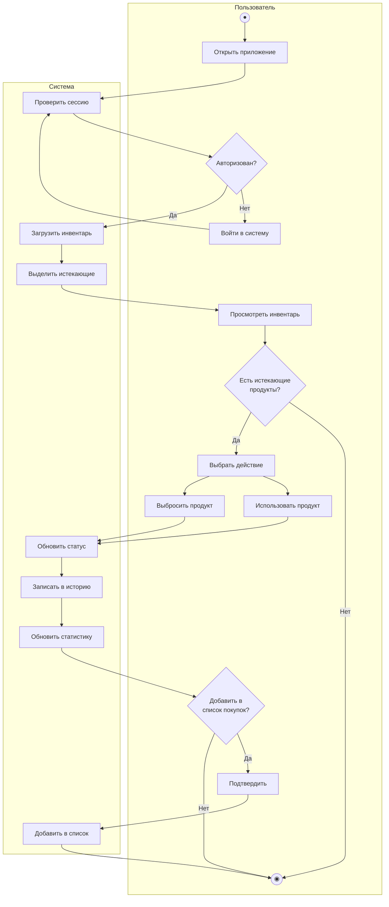

# 2.6. Модели в нотации UML

## 2.6.1. Диаграмма вариантов использования (Use Case) — поведенческая



### Комментарии к диаграмме Use Case

**Акторы:**

| Актор | Описание |
|-------|----------|
| Гость | Неавторизованный пользователь. Может просматривать описание сервиса и регистрироваться |
| Пользователь | Авторизованный участник. Полный доступ к функциям учёта продуктов |
| Владелец домохозяйства | Создатель семейной группы. Управляет участниками |
| Администратор | Технический специалист. Управляет справочником и просматривает логи |

**Основные варианты использования:**

- *Регистрация / Авторизация* — создание аккаунта и вход в систему
- *Добавление продукта* — внесение продукта в инвентарь с возможностью сканирования (extend) и автозаполнения (extend)
- *Списание продукта* — отметка об использовании/утилизации, обязательно включает обновление статистики (include)
- *Управление списком покупок* — ведение списка с расширением переноса в инвентарь (extend)
- *Приглашение участника* — добавление членов семьи в домохозяйство

---

## 2.6.2. Диаграмма классов (Class Diagram) — структурная



### Комментарии к диаграмме классов

**Основные сущности:**

| Класс | Описание |
|-------|----------|
| User | Пользователь системы. Хранит учётные данные и настройки уведомлений |
| Household | Домохозяйство. Объединяет пользователей для совместного доступа |
| HouseholdMember | Связь пользователя с домохозяйством. Роли: owner / member |
| Product | Продукт в инвентаре. Основная сущность с информацией о сроке годности |
| Category | Категория продуктов. Справочник с иконками и сроками хранения по умолчанию |
| ProductTemplate | Шаблон продукта из справочника. Данные из API или ранее добавленных |
| Notification | Уведомление. Привязано к пользователю и продукту |
| ShoppingList | Список покупок. Принадлежит домохозяйству |
| ShoppingItem | Позиция в списке покупок |
| ConsumptionLog | Лог потребления. Фиксирует использование/утилизацию для статистики |

**Ключевые связи:**

- User → Household: пользователь может владеть несколькими домохозяйствами (1:*)
- Household → Product: домохозяйство содержит много продуктов (1:*)
- Product → Notification: один продукт может иметь несколько уведомлений (1:*)
- Product → ConsumptionLog: история действий с продуктом (1:*)

**Статусы Product:**
- `active` — продукт в наличии
- `expiring_soon` — срок истекает в ближайшие дни
- `expired` — срок истёк
- `consumed` — использован
- `discarded` — выброшен

---

## 2.6.3. Диаграмма последовательности (Sequence Diagram) — поведенческая

### Сценарий: Добавление продукта сканированием штрихкода

```mermaid
sequenceDiagram
    autonumber
    participant U as Пользователь
    participant App as Приложение
    participant API as Backend API
    participant CZ as Честный знак
    participant OFF as Open Food Facts
    participant DB as База данных

    U->>App: Открыть сканер
    App->>App: Активировать камеру
    U->>App: Навести на штрихкод
    App->>App: Декодировать штрихкод
    App->>API: POST /products/lookup {barcode}
    
    API->>CZ: GET /product/{datamatrix}
    
    alt Товар найден в Честном знаке
        CZ-->>API: {name, brand, expiry_date}
        API-->>App: {found: true, source: "chestnyznak", data: {...}}
    else Товар не найден
        CZ-->>API: 404 Not Found
        API->>OFF: GET /product/{barcode}
        
        alt Товар найден в Open Food Facts
            OFF-->>API: {name, brand, category, image}
            API-->>App: {found: true, source: "openfoodfacts", data: {...}}
        else Товар не найден
            OFF-->>API: 404 Not Found
            API->>DB: SELECT * FROM product_templates WHERE barcode = ?
            
            alt Товар найден в локальной базе
                DB-->>API: {name, category}
                API-->>App: {found: true, source: "local", data: {...}}
            else Товар не найден
                DB-->>API: null
                API-->>App: {found: false}
            end
        end
    end

    App->>U: Показать форму с данными
    U->>App: Указать срок годности
    U->>App: Выбрать место хранения
    U->>App: Сохранить
    
    App->>API: POST /products {name, barcode, expiry_date, ...}
    API->>DB: INSERT INTO products
    API->>DB: INSERT INTO product_templates (if new)
    API->>API: Рассчитать дату уведомления
    API->>DB: INSERT INTO notifications (scheduled)
    API-->>App: {success: true, product_id}
    App->>U: Продукт добавлен
```

### Сценарий: Автоматическая отправка уведомлений



### Комментарии к диаграммам последовательности

**Сценарий «Добавление продукта»:**

1. **Сканирование (шаги 1–4):** Пользователь открывает сканер, приложение активирует камеру и декодирует штрихкод.

2. **Каскадный поиск (шаги 5–16):** 
   - Приоритет: Честный знак (возвращает срок годности для маркированных товаров)
   - Fallback: Open Food Facts (название, категория, изображение)
   - Финальный fallback: локальная база ранее добавленных товаров

3. **Заполнение формы (шаги 17–20):** Автозаполненные данные показываются пользователю, он дополняет срок годности и место хранения.

4. **Сохранение (шаги 21–26):** Продукт записывается в БД, новый товар добавляется в справочник, планируется уведомление.

**Сценарий «Отправка уведомлений»:**

1. **Запуск (шаги 1–3):** Планировщик (Celery Beat) запускает задачу по расписанию (например, каждый час).

2. **Выборка (шаги 2–3):** Запрос продуктов, у которых срок годности наступает в пределах настроек пользователя.

3. **Обработка (цикл):** Для каждого продукта:
   - Получение настроек пользователей домохозяйства
   - Формирование персонализированного текста
   - Отправка через выбранные каналы (Push и/или Email)
   - Отметка уведомления как отправленного

---

## 2.6.4. Диаграмма деятельности (Activity Diagram) — поведенческая



### Комментарии к диаграмме деятельности

**Дорожки (swimlanes):**
- Пользователь — действия, инициируемые человеком
- Система — автоматические операции

**Основной сценарий:**
1. Пользователь открывает приложение
2. Система проверяет авторизацию
3. Загружается инвентарь с выделением истекающих продуктов
4. Пользователь выбирает действие: использовать или выбросить
5. Система обновляет статус, записывает в историю, обновляет статистику
6. Предложение добавить в список покупок

**Точки принятия решений:**
- Авторизован? — переход к входу или к инвентарю
- Есть истекающие? — продолжение работы или завершение
- Добавить в список? — интеграция со списком покупок
